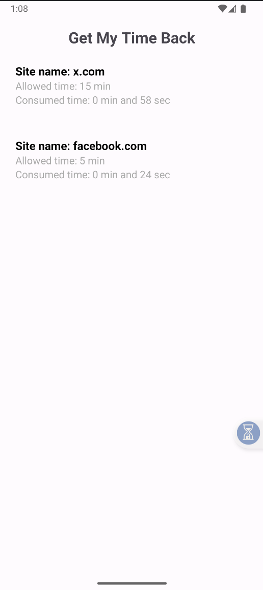

# Get My Time Back

This is an Android app to limit the time spent on specific websites.

It uses the Accessibility Service. I initially thought using this service would be easier than something like a VPN service. But Accessibility is also a very sensitive permission, so it was tricky to use and keep the app running properly—at least on my phone. These are the steps I had to take:

- Allow the Accessibility Service for the app, of course, lol.
- Disable the battery saver option for the app, because it was killing the background process.
- Enable the popup (overlay) permission in the "Other permissions" section of the app settings. This is needed so the app can appear over the browser when time is up.

The app works well, except that from time to time, it seems my phone stops the background service. To fix it, I have to clear the app’s data and re-enable the permissions.  
(There must be ways to fix this... I guess.)

Another drawback/bug of the app: for example, if I’m tracking the site `x.com`, and another website contains the same text (e.g., https://www.datastax.com/), that site will also trigger the timer.

Hey, but despite all the bad things, this app has helped me cut down my time spent on social media to 20 minutes a day (except on the days I have to reset the permissions, lol, but it's still far less than before I had the app).

The app doesn't have any persistent layer, so if you reboot your phone or clear the app data, the counter will start again. So, you’ll need some willpower to keep yourself accountable. Also, if you use a browser that isn’t listed in `MyAccessibilityService.kt`, the app won’t track it—so more willpower needed here, lol.

## How it works

- The Accessibility Service tracks your browser's current tab, and if the website is one of those listed in `app/src/main/assets/blocked_sites.json`, it starts counting.  
- Once the time is up, the app blocks access to the website until the next day. I set the counter to reset at 3 a.m. (I chose this time so I can’t just wait until midnight to browse again 🧠)

## How to use it

- Update `app/src/main/assets/blocked_sites.json` with the websites you want to track and the allowed time.
- I always installed the app directly from Android Studio to my phone, but if you want to build the app, you can use `./gradlew assembleRelease` (tested on Mac).
- I only used it with Chrome, but I guess it works with other browsers listed in `./app/src/main/java/com/example/getmytimeback/data/SupportedBrowsers.kt` too.

## Permissions

- **Accessibility Service:** Required to monitor browser activity.
- **SYSTEM_ALERT_WINDOW:** Used to display overlays when time limits are reached.

## Disclaimer

This app is just for learning.  
Not intended for production use.  
No personal data is collected or transmitted. (doesn't even have Internet permissions)

## Reference

I used this repository as a starting point: https://github.com/ArmanKhanTech/MindMaster

## How the app looks

